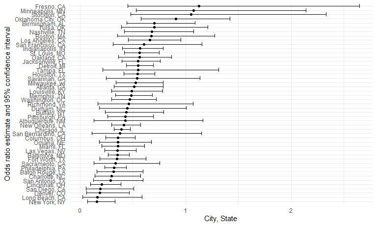

p8105_hw6_rw3031
================
Polly Wu (rw3031)
2024-11-20

``` r
library(tidyverse)
```

    ## ── Attaching core tidyverse packages ──────────────────────── tidyverse 2.0.0 ──
    ## ✔ dplyr     1.1.4     ✔ readr     2.1.5
    ## ✔ forcats   1.0.0     ✔ stringr   1.5.1
    ## ✔ ggplot2   3.5.1     ✔ tibble    3.2.1
    ## ✔ lubridate 1.9.3     ✔ tidyr     1.3.1
    ## ✔ purrr     1.0.2     
    ## ── Conflicts ────────────────────────────────────────── tidyverse_conflicts() ──
    ## ✖ dplyr::filter() masks stats::filter()
    ## ✖ dplyr::lag()    masks stats::lag()
    ## ℹ Use the conflicted package (<http://conflicted.r-lib.org/>) to force all conflicts to become errors

``` r
library(patchwork)
library(ggplot2)
library(httr)
library(modelr)

knitr::opts_chunk$set(
    echo = TRUE,
    warning = FALSE,
  fig.width = 8,
  fig.asp = .6,
  out.width = "90%"
)

theme_set(theme_minimal() + theme(legend.position = "bottom"))

options(
  ggplot2.continuous.colour = "viridis",
  ggplot2.continuous.fill = "viridis"
)

scale_colour_discrete = scale_colour_viridis_d
scale_fill_discrete = scale_fill_viridis_d

set.seed(1)
```

# Problem 1

preparing the weather_dataframe

``` r
weather_df = 
  rnoaa::meteo_pull_monitors(
    c("USW00094728"),
    var = c("PRCP", "TMIN", "TMAX"), 
    date_min = "2017-01-01",
    date_max = "2017-12-31") %>%
  mutate(
    name = recode(id, USW00094728 = "CentralPark_NY"),
    tmin = tmin / 10,
    tmax = tmax / 10) %>%
  select(name, id, everything())
```

    ## Registered S3 method overwritten by 'hoardr':
    ##   method           from
    ##   print.cache_info httr

    ## using cached file: C:\Users\polly\AppData\Local/R/cache/R/rnoaa/noaa_ghcnd/USW00094728.dly

    ## date created (size, mb): 2024-09-26 19:38:55.213327 (8.668)

    ## file min/max dates: 1869-01-01 / 2024-09-30

bootstrapping the data

``` r
bootstrap =
weather_df|>
  modelr::bootstrap(n=5000)|>
  mutate(
    models = map(.x = strap , ~lm(tmax~tmin, data = .x))
  )
```

obtain the results from the model fit

``` r
bootstrap_result = 
bootstrap|>
  mutate(
    r_square = map(models, broom::glance),
    log = map(models, broom::tidy)
  )
```

## plot the distribution for r-squared

``` r
bootstrap_result|>
  unnest(r_square)|>
  select(r.squared)|>
  ggplot(aes(x=r.squared))+geom_histogram()
```

    ## `stat_bin()` using `bins = 30`. Pick better value with `binwidth`.


\## the 95% confidence interval for r-squared

``` r
bootstrap_result|>
  unnest(r_square)|>
  select(r.squared)|>
  summarise(quantile_2.5 = quantile(r.squared, probs = 0.025),
            quantile_97.5 = quantile(r.squared, probs = 0.975))
```

    ## # A tibble: 1 × 2
    ##   quantile_2.5 quantile_97.5
    ##          <dbl>         <dbl>
    ## 1        0.894         0.927

The 95% confidence interval for r-squared is 0.8934 - 0.9275

``` r
bootstrap_log = 
bootstrap_result|>
  unnest(log)|>
  select(.id, term, estimate)|>
  pivot_wider(
    names_from = term,
    names_prefix = "beta_",
    values_from = estimate
  )|>
  rename(beta_0 = "beta_(Intercept)",
         beta_1 = beta_tmin)|>
  mutate(log = log(beta_0*beta_1))
```

## plot for distribution of the log(beta_1\*beta_0)

``` r
bootstrap_log|>
  ggplot(aes(x=log))+geom_histogram()
```

    ## `stat_bin()` using `bins = 30`. Pick better value with `binwidth`.


\## 95% confidence interval for log(beta_0\*beta_1)

``` r
bootstrap_log|>
  summarise(quantile_2.5 = quantile(log, probs = 0.025),
            quantile_97.5 = quantile(log, probs = 0.975))
```

    ## # A tibble: 1 × 2
    ##   quantile_2.5 quantile_97.5
    ##          <dbl>         <dbl>
    ## 1         1.96          2.06

The 95% confidence interval for log(beta_0\*beta_1) is 1.9654 - 2.0581

# Problem 2

``` r
homocide = 
  read_csv("./homicide-data.csv")|>
  janitor::clean_names()|>
  mutate(city_state = str_c(city, state, sep = ", "))|>
  filter(!city_state %in% c("Dallas, TX","Phoenix, AZ","Kansas City, MO", "Tulsa, AL"),
         victim_race %in% c("White", "Black"))|>
  mutate(victim_age = as.numeric(victim_age))
```

    ## Rows: 52179 Columns: 12
    ## ── Column specification ────────────────────────────────────────────────────────
    ## Delimiter: ","
    ## chr (9): uid, victim_last, victim_first, victim_race, victim_age, victim_sex...
    ## dbl (3): reported_date, lat, lon
    ## 
    ## ℹ Use `spec()` to retrieve the full column specification for this data.
    ## ℹ Specify the column types or set `show_col_types = FALSE` to quiet this message.

## fit glm model for baltimore

``` r
homocide|>
  filter(city_state == "Baltimore, MD")|>
  mutate(
    resolve = case_when(
      disposition == "Open/No arrest" ~ 0,
      TRUE ~ 1))|>
  summarise(model = list(glm(resolve~victim_age+victim_race+victim_sex, family = "binomial")))|>
  mutate(results = map(model, ~ broom::tidy(.x, conf.int = TRUE, exponentiate = TRUE)))|>
  unnest(results)|>
  select(term, estimate, conf.low, conf.high)|>
  filter(term == "victim_sexMale")
```

    ## # A tibble: 1 × 4
    ##   term           estimate conf.low conf.high
    ##   <chr>             <dbl>    <dbl>     <dbl>
    ## 1 victim_sexMale    0.355    0.267     0.468

``` r
homocide_glm = 
homocide|>
  mutate(
    resolve = case_when(
      disposition == "Open/No arrest" ~ 0,
      TRUE ~ 1))|>
  group_by(city_state)|>
  nest()|>
  mutate(model = map(.x=data, ~glm(resolve~victim_age+victim_race+victim_sex, 
                                         data = .x, family="binomial")),
         results = map(model, ~ broom::tidy(.x, conf.int = TRUE, exponentiate = TRUE)))|>
  unnest(results)|>
  select(term, estimate, conf.low, conf.high)|>
  filter(term == "victim_sexMale")|>
  select(-term)
```

    ## Adding missing grouping variables: `city_state`

``` r
homocide_glm|>
  knitr::kable()
```

| city_state         |  estimate |  conf.low | conf.high |
|:-------------------|----------:|----------:|----------:|
| Albuquerque, NM    | 0.4300644 | 0.1321195 | 1.1644219 |
| Atlanta, GA        | 0.5120657 | 0.3227145 | 0.7886948 |
| Baltimore, MD      | 0.3546711 | 0.2672667 | 0.4679109 |
| Baton Rouge, LA    | 0.3187872 | 0.1601217 | 0.5956190 |
| Birmingham, AL     | 0.7040171 | 0.4440724 | 1.0921842 |
| Boston, MA         | 0.6739912 | 0.3534469 | 1.2768225 |
| Buffalo, NY        | 0.4382357 | 0.2389619 | 0.7934521 |
| Charlotte, NC      | 0.3008165 | 0.1426146 | 0.5720224 |
| Chicago, IL        | 0.3908413 | 0.3207534 | 0.4758303 |
| Cincinnati, OH     | 0.2055070 | 0.0976513 | 0.3898734 |
| Columbus, OH       | 0.3605504 | 0.2434995 | 0.5246615 |
| Denver, CO         | 0.1866018 | 0.0612606 | 0.4655967 |
| Detroit, MI        | 0.5521572 | 0.4376513 | 0.6957475 |
| Durham, NC         | 0.4500757 | 0.1810859 | 1.0068183 |
| Fort Worth, TX     | 0.3514460 | 0.1885182 | 0.6252373 |
| Fresno, CA         | 1.1288724 | 0.4541441 | 2.6482320 |
| Houston, TX        | 0.5439159 | 0.4142318 | 0.7085284 |
| Indianapolis, IN   | 0.5671757 | 0.4026431 | 0.7898494 |
| Jacksonville, FL   | 0.5524443 | 0.3988218 | 0.7583191 |
| Las Vegas, NV      | 0.3555558 | 0.2321529 | 0.5301228 |
| Long Beach, CA     | 0.1650030 | 0.0258393 | 0.5879543 |
| Los Angeles, CA    | 0.6618816 | 0.4565014 | 0.9541036 |
| Louisville, KY     | 0.4905546 | 0.3014879 | 0.7836391 |
| Memphis, TN        | 0.4856247 | 0.3373806 | 0.6850299 |
| Miami, FL          | 0.3575003 | 0.2042412 | 0.6128066 |
| Milwaukee, wI      | 0.5267948 | 0.3433924 | 0.7891580 |
| Minneapolis, MN    | 1.0752482 | 0.5330060 | 2.1421664 |
| Nashville, TN      | 0.6822269 | 0.4192049 | 1.0777906 |
| New Orleans, LA    | 0.4146129 | 0.2974592 | 0.5748185 |
| New York, NY       | 0.1613183 | 0.0691111 | 0.3313113 |
| Oakland, CA        | 0.5630819 | 0.3637421 | 0.8671086 |
| Oklahoma City, OK  | 0.9088271 | 0.5779497 | 1.4225063 |
| Omaha, NE          | 0.3580891 | 0.1810716 | 0.6777943 |
| Philadelphia, PA   | 0.3241547 | 0.2351963 | 0.4395746 |
| Pittsburgh, PA     | 0.4307528 | 0.2626022 | 0.6955518 |
| Richmond, VA       | 0.4598351 | 0.1673424 | 1.0723841 |
| San Antonio, TX    | 0.2877665 | 0.1255789 | 0.5950376 |
| Sacramento, CA     | 0.3373690 | 0.1317522 | 0.7567081 |
| Savannah, GA       | 0.5404376 | 0.2458680 | 1.1351176 |
| San Bernardino, CA | 0.3804816 | 0.1118644 | 1.1488399 |
| San Diego, CA      | 0.1935152 | 0.0559611 | 0.5107881 |
| San Francisco, CA  | 0.6075362 | 0.3116925 | 1.1551470 |
| St. Louis, MO      | 0.5640965 | 0.4221196 | 0.7506507 |
| Stockton, CA       | 1.0545534 | 0.4803016 | 2.3320354 |
| Tampa, FL          | 0.5510486 | 0.2135644 | 1.3109552 |
| Tulsa, OK          | 0.7025057 | 0.3920137 | 1.2113940 |
| Washington, DC     | 0.4711307 | 0.2998001 | 0.7202004 |

## plot for the or estimate and confidence interval on homocide for each city

``` r
homocide_glm|>
  arrange(desc(estimate))|>
  ggplot(aes(y=fct_reorder(city_state,estimate), x=estimate))+
  geom_point() +
  geom_errorbar(aes(xmin = conf.low, xmax = conf.high))+
  labs(
    x = "City, State",
    y = "Odds ratio estimate and 95% confidence interval"
  )
```



# Problem 3

## import the birthweight data

``` r
birthweight = 
  read_csv("./birthweight.csv")
```

    ## Rows: 4342 Columns: 20
    ## ── Column specification ────────────────────────────────────────────────────────
    ## Delimiter: ","
    ## dbl (20): babysex, bhead, blength, bwt, delwt, fincome, frace, gaweeks, malf...
    ## 
    ## ℹ Use `spec()` to retrieve the full column specification for this data.
    ## ℹ Specify the column types or set `show_col_types = FALSE` to quiet this message.

``` r
summary(birthweight)
```

    ##     babysex          bhead          blength           bwt           delwt      
    ##  Min.   :1.000   Min.   :21.00   Min.   :20.00   Min.   : 595   Min.   : 86.0  
    ##  1st Qu.:1.000   1st Qu.:33.00   1st Qu.:48.00   1st Qu.:2807   1st Qu.:131.0  
    ##  Median :1.000   Median :34.00   Median :50.00   Median :3132   Median :143.0  
    ##  Mean   :1.486   Mean   :33.65   Mean   :49.75   Mean   :3114   Mean   :145.6  
    ##  3rd Qu.:2.000   3rd Qu.:35.00   3rd Qu.:51.00   3rd Qu.:3459   3rd Qu.:157.0  
    ##  Max.   :2.000   Max.   :41.00   Max.   :63.00   Max.   :4791   Max.   :334.0  
    ##     fincome          frace          gaweeks         malform        
    ##  Min.   : 0.00   Min.   :1.000   Min.   :17.70   Min.   :0.000000  
    ##  1st Qu.:25.00   1st Qu.:1.000   1st Qu.:38.30   1st Qu.:0.000000  
    ##  Median :35.00   Median :2.000   Median :39.90   Median :0.000000  
    ##  Mean   :44.11   Mean   :1.655   Mean   :39.43   Mean   :0.003455  
    ##  3rd Qu.:65.00   3rd Qu.:2.000   3rd Qu.:41.10   3rd Qu.:0.000000  
    ##  Max.   :96.00   Max.   :8.000   Max.   :51.30   Max.   :1.000000  
    ##     menarche        mheight          momage         mrace      
    ##  Min.   : 0.00   Min.   :48.00   Min.   :12.0   Min.   :1.000  
    ##  1st Qu.:12.00   1st Qu.:62.00   1st Qu.:18.0   1st Qu.:1.000  
    ##  Median :12.00   Median :63.00   Median :20.0   Median :2.000  
    ##  Mean   :12.51   Mean   :63.49   Mean   :20.3   Mean   :1.627  
    ##  3rd Qu.:13.00   3rd Qu.:65.00   3rd Qu.:22.0   3rd Qu.:2.000  
    ##  Max.   :19.00   Max.   :77.00   Max.   :44.0   Max.   :4.000  
    ##      parity            pnumlbw     pnumsga      ppbmi            ppwt      
    ##  Min.   :0.000000   Min.   :0   Min.   :0   Min.   :13.07   Min.   : 70.0  
    ##  1st Qu.:0.000000   1st Qu.:0   1st Qu.:0   1st Qu.:19.53   1st Qu.:110.0  
    ##  Median :0.000000   Median :0   Median :0   Median :21.03   Median :120.0  
    ##  Mean   :0.002303   Mean   :0   Mean   :0   Mean   :21.57   Mean   :123.5  
    ##  3rd Qu.:0.000000   3rd Qu.:0   3rd Qu.:0   3rd Qu.:22.91   3rd Qu.:134.0  
    ##  Max.   :6.000000   Max.   :0   Max.   :0   Max.   :46.10   Max.   :287.0  
    ##      smoken           wtgain      
    ##  Min.   : 0.000   Min.   :-46.00  
    ##  1st Qu.: 0.000   1st Qu.: 15.00  
    ##  Median : 0.000   Median : 22.00  
    ##  Mean   : 4.145   Mean   : 22.08  
    ##  3rd Qu.: 5.000   3rd Qu.: 28.00  
    ##  Max.   :60.000   Max.   : 89.00

## clean the birthweight data for analysis

I convert the categorical variables from numeric to factor and remove
the variables with complete missing values

``` r
birthweight =
birthweight|>
  mutate(babysex = factor(babysex),
         frace = factor(frace),
         malform = factor(malform),
         mrace = factor(mrace))|>
  select(-pnumlbw,-pnumsga)


summary(birthweight)
```

    ##  babysex      bhead          blength           bwt           delwt      
    ##  1:2230   Min.   :21.00   Min.   :20.00   Min.   : 595   Min.   : 86.0  
    ##  2:2112   1st Qu.:33.00   1st Qu.:48.00   1st Qu.:2807   1st Qu.:131.0  
    ##           Median :34.00   Median :50.00   Median :3132   Median :143.0  
    ##           Mean   :33.65   Mean   :49.75   Mean   :3114   Mean   :145.6  
    ##           3rd Qu.:35.00   3rd Qu.:51.00   3rd Qu.:3459   3rd Qu.:157.0  
    ##           Max.   :41.00   Max.   :63.00   Max.   :4791   Max.   :334.0  
    ##     fincome      frace       gaweeks      malform     menarche    
    ##  Min.   : 0.00   1:2123   Min.   :17.70   0:4327   Min.   : 0.00  
    ##  1st Qu.:25.00   2:1911   1st Qu.:38.30   1:  15   1st Qu.:12.00  
    ##  Median :35.00   3:  46   Median :39.90            Median :12.00  
    ##  Mean   :44.11   4: 248   Mean   :39.43            Mean   :12.51  
    ##  3rd Qu.:65.00   8:  14   3rd Qu.:41.10            3rd Qu.:13.00  
    ##  Max.   :96.00            Max.   :51.30            Max.   :19.00  
    ##     mheight          momage     mrace        parity             ppbmi      
    ##  Min.   :48.00   Min.   :12.0   1:2147   Min.   :0.000000   Min.   :13.07  
    ##  1st Qu.:62.00   1st Qu.:18.0   2:1909   1st Qu.:0.000000   1st Qu.:19.53  
    ##  Median :63.00   Median :20.0   3:  43   Median :0.000000   Median :21.03  
    ##  Mean   :63.49   Mean   :20.3   4: 243   Mean   :0.002303   Mean   :21.57  
    ##  3rd Qu.:65.00   3rd Qu.:22.0            3rd Qu.:0.000000   3rd Qu.:22.91  
    ##  Max.   :77.00   Max.   :44.0            Max.   :6.000000   Max.   :46.10  
    ##       ppwt           smoken           wtgain      
    ##  Min.   : 70.0   Min.   : 0.000   Min.   :-46.00  
    ##  1st Qu.:110.0   1st Qu.: 0.000   1st Qu.: 15.00  
    ##  Median :120.0   Median : 0.000   Median : 22.00  
    ##  Mean   :123.5   Mean   : 4.145   Mean   : 22.08  
    ##  3rd Qu.:134.0   3rd Qu.: 5.000   3rd Qu.: 28.00  
    ##  Max.   :287.0   Max.   :60.000   Max.   : 89.00

## build my regression model for birthweight

My assumption is that child birthweight is going to be associated with
gestational age in weeks, mother’s race, and average number of
cigarettes smoked per day during pregnancy.

``` r
fit_bw = lm(bwt ~ gaweeks+mrace+smoken, data=birthweight)

fit_bw|>
  broom::tidy()|>
  knitr::kable(digits = 4)
```

| term        |  estimate | std.error | statistic | p.value |
|:------------|----------:|----------:|----------:|--------:|
| (Intercept) |  944.5592 |   88.0502 |   10.7275 |  0.0000 |
| gaweeks     |   59.6898 |    2.1815 |   27.3620 |  0.0000 |
| mrace2      | -286.1845 |   14.7126 |  -19.4517 |  0.0000 |
| mrace3      | -177.8922 |   68.7813 |   -2.5863 |  0.0097 |
| mrace4      | -192.4837 |   30.3638 |   -6.3393 |  0.0000 |
| smoken      |  -10.8900 |    0.9443 |  -11.5323 |  0.0000 |

## getting the residual plot

``` r
birthweight|>
  modelr::add_residuals(fit_bw)|>
  modelr::add_predictions(fit_bw)|>
  ggplot(aes(x=pred, y= resid))+geom_point(alpha = 0.3)
```


Since the residual is quite randomly scattered around 0, we conclude the
overall fit of the model is good.

## build the model using birth length and gestational age

``` r
fit_length = lm(bwt ~ blength+gaweeks, data=birthweight)

fit_length|>
  broom::tidy()|>
  knitr::kable(digits = 4)
```

| term        |   estimate | std.error | statistic | p.value |
|:------------|-----------:|----------:|----------:|--------:|
| (Intercept) | -4347.6671 |   97.9584 |  -44.3828 |       0 |
| blength     |   128.5557 |    1.9899 |   64.6044 |       0 |
| gaweeks     |    27.0467 |    1.7179 |   15.7438 |       0 |

## build the model for head circumference, length, and sex

``` r
fit_headlengthsex = lm(bwt ~ bhead+blength+babysex
                       +bhead*blength+blength*babysex+babysex*bhead+bhead*blength*babysex,
                       data=birthweight)

fit_headlengthsex|>
  broom::tidy()|>
  knitr::kable(digits = 4)
```

| term                   |   estimate | std.error | statistic | p.value |
|:-----------------------|-----------:|----------:|----------:|--------:|
| (Intercept)            | -7176.8170 | 1264.8397 |   -5.6741 |  0.0000 |
| bhead                  |   181.7956 |   38.0542 |    4.7773 |  0.0000 |
| blength                |   102.1269 |   26.2118 |    3.8962 |  0.0001 |
| babysex2               |  6374.8684 | 1677.7669 |    3.7996 |  0.0001 |
| bhead:blength          |    -0.5536 |    0.7802 |   -0.7096 |  0.4780 |
| blength:babysex2       |  -123.7729 |   35.1185 |   -3.5244 |  0.0004 |
| bhead:babysex2         |  -198.3932 |   51.0917 |   -3.8831 |  0.0001 |
| bhead:blength:babysex2 |     3.8781 |    1.0566 |    3.6702 |  0.0002 |

## cross validation

``` r
cv_df =
  crossv_mc(birthweight, 100)
```

``` r
cv_df =
cv_df|>
  mutate(model_gaweeks = map(train, \(df) lm(bwt ~ gaweeks+mrace+smoken, data=df)),
         model_length = map(train, \(df) lm(bwt ~ blength+gaweeks, data=df)),
         model_headlengthsex = map(train, \(df) lm(bwt ~ bhead+blength+babysex
                       +bhead*blength+blength*babysex+babysex*bhead+bhead*blength*babysex,
                       data=df))
           )|>
  mutate(
    rmse_gaweeks = map2_dbl(model_gaweeks, test, \(mod, df) rmse(model = mod, data = df)),
    rmse_length = map2_dbl(model_length, test, \(mod, df) rmse(model = mod, data = df)),
    rmse_headlengthsex = map2_dbl(model_headlengthsex, test, \(mod, df) rmse(model = mod,      data = df))
  )
```

``` r
cv_df |> 
  select(starts_with("rmse")) |> 
  pivot_longer(
    everything(),
    names_to = "model", 
    values_to = "rmse",
    names_prefix = "rmse_") |> 
  mutate(model = fct_inorder(model)) |> 
  ggplot(aes(x = model, y = rmse)) + geom_violin()
```


Based on the rootmean square models, the headlengthsex model has the
smallest rmse thus we conclude that to be the best model of the three
models.
